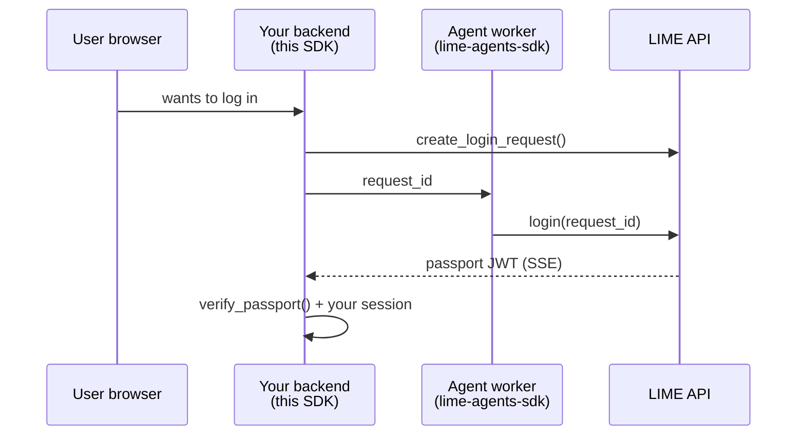

# lime-sites-sdk

Python library for **your website backend** — the server that runs your site and creates
user sessions.

[](https://pypi.org/project/lime-sites-sdk/)
[](https://lime-sites-sdk.readthedocs.io/)
[](https://github.com/Mawyxx/lime-site-sdk)

## Who is this for?

You registered a **site** in the [LIME portal](https://lime.pics) and got a secret
`site_token`. This SDK runs on **your backend** (FastAPI, Django ASGI, etc.) to:

1. Start a login when a user wants to sign in through an agent
2. Wait for the agent to approve
3. Verify the passport and create **your** local session

You do **not** need this SDK in the agent worker — that side uses
[lime-agents-sdk](https://lime-agents-sdk.readthedocs.io/).

## One scenario — site login

There is no MCP in this package.



## Class structure: `LimeSite`

| Step | Method | Returns |
|------|--------|---------|
| 1 | `LimeSite()` | client (inside asyncio loop) |
| 2 | `@site.on_login` handler | registers SSE callback |
| 3 | `await site.create_login_request()` | `LoginRequestResult` |
| 4 | `await site.verify_passport(jwt, ...)` | `PassportVerificationResult` |
| 5 | `await site.aclose()` | cleanup |

Full signatures: [API Reference](api.md).

## Minimal example

```python
import asyncio
from lime_sites import LimeSite

async def main() -> None:
    site = LimeSite()  # inside asyncio.run() or FastAPI lifespan

    @site.on_login
    async def on_login(request_id: str, passport: str | None) -> None:
        if passport:
            ok = await site.verify_passport(passport, expected_request_id=request_id)
            if ok.valid:
                print("Agent:", ok.claims["sub"])

    req = await site.create_login_request()
    print("Give this to agent:", req.request_id)
    await site.aclose()

asyncio.run(main())
```

## What you need before coding

| Item | Where to get it |
|------|-----------------|
| `LIME_SITE_TOKEN` | LIME portal → your site → copy token once |
| Agent approval | Agent worker calls `login(request_id)` |

Optional: `LIME_API_BASE` — default `https://lime.pics/api/v1`.

## Install

```bash
pip install lime-sites-sdk
```

Details: [Installation](installation.md)

## Other LIME SDKs

| SDK | Your role |
|-----|-----------|
| [lime-agents-sdk](https://lime-agents-sdk.readthedocs.io/) | Agent worker |
| **lime-sites-sdk** (this) | Website backend |
| [lime-mcp-server-sdk](https://lime-mcp-server-sdk.readthedocs.io/) | MCP server |

Platform HTTP reference: [lime.pics/docs](https://lime.pics/docs#guide-siteSdk)

## Next pages

1. [Quick Start](quickstart.md) — step-by-step with FastAPI
2. [API Reference](api.md) — every method
3. [Examples](examples.md) — idempotent handlers, sessions
